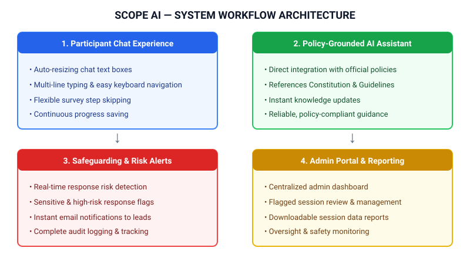

# Client Progress Report – Executive Summary

**Date:** August 10, 2026  
**Project:** Scope AI (Raft Mental Health & Survey Platform)  
**Status:** Completed & Validated  

---

## System Overview

---

## Executive Highlights

1. 🚨 **Automated Safeguarding & Risk Alerts**  
   Participant responses containing high-risk phrases or indicators of distress automatically trigger immediate email alerts to designated safeguarding leads.

2. 📚 **AI Grounded in Official Policies**  
   The AI assistant references official governance and strategy guidelines (*Constitution of The Raft*, *Strategy*, and *Safeguarding Policy*) to deliver accurate, policy-compliant guidance.

3. 💬 **Enhanced User Chat Experience**  
   Survey text boxes automatically expand to fit multi-line answers comfortably, with intuitive navigation allowing users to skip optional sections easily.

4. 📊 **Admin Dashboard & Reporting**  
   Supervisors can filter flagged participant sessions, monitor safety logs in real time, and export summary data reports.

---

## Key Benefits Summary

| Priority Area | Value Delivered |
| :--- | :--- |
| **Participant Safety** | Instant alerts ensure vulnerable individuals receive prompt attention from safety officers. |
| **Response Accuracy** | Direct grounding in organizational guidelines guarantees reliable and policy-compliant AI responses. |
| **User Experience** | Expanding text boxes and flexible survey navigation make completing responses effortless. |
| **Management & Oversight** | Easy-to-read dashboards and export tools streamline supervisory reviews and audit readiness. |
